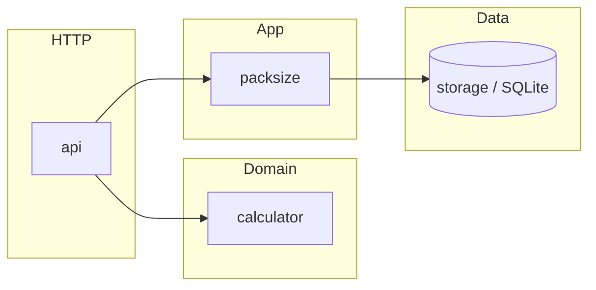

# Order Packs Calculator

HTTP API and small web UI to decide **how many packs of each size** to ship for an order. Business rules (in order of priority):

1. **Whole packs only** — no partial packs.
2. **Minimise total items shipped** — ship no more than necessary (may overshoot the order).
3. **Minimise number of packs** — among solutions that satisfy (2), use as few packs as possible.

Pack sizes are **editable at runtime** (API or UI) and **persisted in SQLite** so restarts keep configuration. The server is a **single static binary** with embedded SQL migrations and static UI assets.

**Live:** [https://re-partners-challenge-1.onrender.com/](https://re-partners-challenge-1.onrender.com/)

---

## Architecture

Layers are split so the core logic stays testable without HTTP or a database:

| Layer | Package | Role |
|-------|-----------|------|
| Entry | `cmd/server` | Wires DB, services, HTTP router, graceful shutdown |
| HTTP | `internal/api` | JSON request/response, validation, status codes |
| Domain | `internal/calculator` | Pure pack-allocation algorithm (no I/O) |
| App | `internal/packsize` | Validates pack-size lists; reads/writes `pack_sizes` in a transaction |
| Persistence | `internal/storage` | SQLite connection, pragmas, embedded migrations |
| UI | `internal/webui` | Embedded static files (`//go:embed`) |

Dependency direction: `calculator` has no internal dependencies; `packsize` depends only on `storage`; `api` depends on `calculator` and `packsize`.



---

## Requirements

- **Go:** 1.23+ (`go.mod` may list a newer toolchain; older toolchains can still build.)
- **Environment variables**

| Variable | Default | Meaning |
|----------|---------|---------|
| `PORT` | `8080` | HTTP listen port |
| `DB_PATH` | `./app.db` (local) / `/data/app.db` (Dockerfile) | SQLite file path |

---

## Quick start (local)

```bash
make run
curl http://localhost:8080/api/pack-sizes
curl -X POST http://localhost:8080/api/calculate \
     -H "Content-Type: application/json" \
     -d '{"items":12001}'
open http://localhost:8080/
```

First startup seeds default sizes `[250, 500, 1000, 2000, 5000]` if the table is empty.

---

## Containerization

**Build image**

```bash
make docker-build
# or
docker build -t pack-calculator:latest .
```

**Run with Compose** (persists SQLite under a named volume `pack-data`):

```bash
docker compose up -d --build
# UI and API: http://localhost:8080/
docker compose down
```

**Run container manually**

```bash
docker run --rm -p 8080:8080 -v pack-data:/data pack-calculator:latest
```

The runtime image is **distroless** (no shell). Health checks from *inside* the container are not used in Compose; verify from the host: `curl http://localhost:8080/healthz`.

---

## API reference

`Content-Type: application/json` for bodies; responses are JSON.

### `GET /healthz`

Liveness / readiness style probe.

```json
{ "status": "ok" }
```

### `GET /api/pack-sizes`

Current pack sizes (ascending).

```json
{ "sizes": [250, 500, 1000, 2000, 5000] }
```

### `PUT /api/pack-sizes`

Replaces the full list atomically. Duplicates removed; result sorted ascending. **400** if empty or any non-positive size.

```bash
curl -X PUT http://localhost:8080/api/pack-sizes \
     -H "Content-Type: application/json" \
     -d '{"sizes":[23,31,53]}'
```

### `POST /api/calculate`

Computes allocation.

Request — `sizes` optional (uses stored config when omitted):

```json
{
  "items": 12001,
  "sizes": [250, 500, 1000, 2000, 5000]
}
```

Example response:

```json
{
  "packs": [
    { "size": 5000, "quantity": 2 },
    { "size": 2000, "quantity": 1 },
    { "size": 250,  "quantity": 1 }
  ],
  "total_items": 12250,
  "total_packs": 4
}
```

**400** for invalid JSON, negative `items`, missing sizes when none stored, or `items` above `100_000_000` (protects server memory).

---

## Algorithm (summary)

Dynamic programming over item counts `0 … items + max(pack size)`: for each total `i`, store the minimum number of packs to reach exactly `i` (unreachable → sentinel), and one “parent” pack size for backtracking. The answer is the **smallest** `i ≥ order size` that is reachable; walking parents from `i` down to `0` yields counts per size. That enforces “minimise overshoot first, then minimise pack count” for non-negative pack sizes.

Implementation: [`internal/calculator/calculator.go`](internal/calculator/calculator.go). Tests include examples, edge cases, and invariants: [`internal/calculator/calculator_test.go`](internal/calculator/calculator_test.go).

---

## Project layout

```
.
├── cmd/server/main.go          # listen, DB open/migrate, seed, routes
├── internal/
│   ├── api/                    # Chi router, handlers, JSON
│   ├── calculator/             # allocation algorithm + tests
│   ├── packsize/               # pack size CRUD + tests
│   ├── storage/                # SQLite + embedded migrations
│   └── webui/                  # embedded static UI
├── Dockerfile
├── docker-compose.yml
├── render.yaml                 # optional Render deploy
├── Makefile
└── README.md
```

---

## Testing

```bash
make test          # race detector, all packages
make test-cover    # coverage report
make bench         # calculator benchmark
go test ./... -v   # verbose
```

Coverage includes:

- **`internal/calculator`** — examples, validation, large order, tie-breaking, property-style checks.
- **`internal/packsize`** — empty DB, seed idempotency, replace + validation.
- **`internal/api`** — pack-size GET/PUT, calculate with stored vs inline sizes, errors, health.

---

## Deployment note

Example Render blueprint: [`render.yaml`](render.yaml). Persistent disk should match `DB_PATH` (image defaults to `/data/app.db`).
